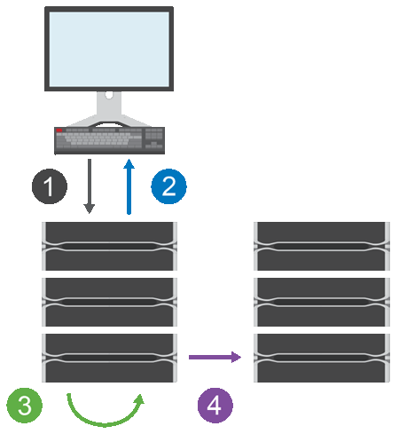

= How asynchronous mirroring works
:icons: font
:imagesdir: ../media/

[.lead]
Asynchronous mirroring copies data volumes on demand or on a schedule, which minimizes or avoids downtime that might result from data corruption or loss.

[NOTE]
====
Mirroring is not available on the EF600 or EF300 storage array.
====

Asynchronous mirroring captures the state of the primary volume at a particular point in time and copies just the data that has changed since the last image capture. The primary site can be updated immediately and the secondary site can be updated as bandwidth allows. The information is cached and sent later, as network resources become available.

This type of mirroring is ideal for satisfying the demand for non-stop operations and, in general, is far more network efficient for periodic processes, such as backup and archive. The reasons for using asynchronous mirroring include the following:

* Remote backup consolidation.
* Protect against local or wide-area disasters.
* Application development and testing on a point-in-time image of live data.

== Asynchronous mirroring session

Asynchronous mirroring captures the state of the primary volume at a particular point in time and copies just the data that has changed since the last image capture. Asynchronous mirroring allows the primary site to be updated immediately and the secondary site to be updated as bandwidth allows. The information is cached and sent later, as network resources become available.

There are four primary steps in an active asynchronous mirroring session.

. A write operation first occurs on the primary volume's storage array.
. The status of the operation is returned to the host.
. All changes on the primary volume are logged and tracked.
. All changes are sent to the secondary volume's storage array as a background process.

These steps are repeated according to the defined synchronization intervals or the steps can be repeated manually if no intervals are defined.

Asynchronous mirroring transfers data to the remote site only at set intervals, so local I/O is not affected nearly as much by slow network connections. Because this transfer is not tied to the local I/O, it does not affect application performance. Therefore, asynchronous mirroring can use slower connections, such as iSCSI, and run across longer distances between the local and remote storage systems.

The storage arrays must have a minimum firmware version of 7.84. (They can each run different OS versions.)

== Mirror consistency groups and mirrored pairs

You create a mirror consistency group to establish the mirroring relationship between the local storage array and the remote storage array. The asynchronous mirroring relationship consists of a mirrored pair: a primary volume on one storage array and a secondary volume on another storage array.

The storage array containing the primary volume is usually located at the primary site and serves the active hosts. The storage array containing the secondary volume is usually located at a secondary site and holds a replica of the data. The secondary volume typically contains a backup copy of the data and is used for disaster recovery.

== Synchronization settings

When you create a mirrored pair, you also define the synchronization priority and resynchronization policy that the mirrored pair uses to complete the resynchronization operation after a communication interruption.

When you create a mirror consistency group, you also define the synchronization priority and resynchronization policy for all mirrored pairs within the group. The mirrored pairs use the synchronization priority and resynchronization policy to complete the resynchronization operation after a communication interruption.

The primary and secondary volumes in a mirrored pair can become unsynchronized when the primary volume's storage array is unable to write data to the secondary volume. This condition can be caused by the following issues:

* Network problems between the local and remote storage arrays.
* A failed secondary volume.
* Synchronization being manually suspended on the mirrored pair.
* Mirror group role conflict.

You can synchronize data on the remote storage array either manually or automatically.

== Reserved capacity and asynchronous mirroring

Reserved capacity is used to keep track of differences between the primary and secondary volume when synchronization is not occurring. It also keeps track of synchronization statistics for each mirrored pair.

Each volume in a mirrored pair requires its own reserved capacity.

== Configuration and management

To enable and configure mirroring between two arrays, you must use the Unified Manager interface. Once mirroring is enabled, you can manage mirrored pairs and synchronization settings in System Manager.
