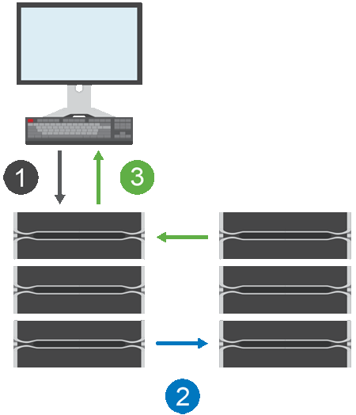

= How synchronous mirroring works
:icons: font
:imagesdir: ../media/

[.lead]
Synchronous mirroring replicates data volumes in real time to ensure continuous availability.

[NOTE]
====
Mirroring is not available on the EF600 or EF300 storage array.
====

Synchronous mirroring achieves a recovery point objective (RPO) of zero lost data by having a copy of important data available if a disaster happens on one of the two storage arrays. The copy is identical to production data at every moment because each time a write is done to the primary volume, a write is done to the secondary volume. The host does not receive an acknowledgment that the write was successful until the secondary volume is successfully updated with the changes that were made on the primary volume.

This type of mirroring is ideal for business continuity purposes such as disaster recovery.

== Synchronous mirroring relationship

A synchronous mirroring relationship consists of a primary volume and a secondary volume on separate storage arrays. The storage array containing the primary volume is usually located at the primary site and serves the active hosts. The storage array containing the secondary volume is usually located at a secondary site and holds a replica of the data. The secondary volume is used if the primary volume's storage array is unavailable because of, for example, a complete power outage, a fire, or a hardware failure at the primary site.

== Synchronous mirroring session

The synchronous mirroring configuration process involves configuring volumes into pairs. After you create a mirrored pair, which consists of a primary volume on one storage array and a secondary volume on another storage array, you can start synchronous mirroring. The steps in synchronous mirroring are depicted below.

. A write comes in from the host.
. The write is committed to the primary volume, propagated to the remote system, and then committed to the secondary volume.
. The primary volume's storage array sends an I/O completion message to the host system _after_ both write operations have been successfully completed.

Reserved capacity is used to log information about the incoming write request from a host.

When the current controller owner of the primary volume receives a write request from a host, the controller first logs information about the write to the primary volume's reserved capacity. It then writes the data to the primary volume. Next, the controller initiates a remote write operation to copy the affected data blocks to the secondary volume at the remote storage array.

Because the host application must wait for the write to occur on the local storage array and across the network on the remote storage array, a very fast connection between the local storage array and remote storage array is required to maintain the mirror relationship without overly reducing local I/O performance.

== Disaster recovery

Synchronous mirroring maintains a copy of data that is physically distant from the site where the data resides. If a disaster occurs at the primary site, such as a power outage or a flood, the data can be quickly accessed from the secondary site.

The secondary volume is unavailable to host applications while the synchronous mirroring operation is in progress, so, in the event of a disaster at the local storage array, you can fail over to the remote storage array. To fail over, promote the secondary volume to the primary role. Then the recovery host is able to access the newly promoted volume, and business operations can continue.

== Synchronization settings

When you create a mirrored pair, you also define the synchronization priority and resynchronization policy that the mirrored pair uses to complete the resynchronization operation after a communication interruption.

If the communication link between the two storage arrays stops working, hosts continue to receive acknowledgements from the local storage array, preventing an access loss. When the communication link is working again, any unreplicated data can be automatically or manually resynced to the remote storage array.

Whether data is resynchronized automatically depends on the mirrored pair's resynchronization policy. An automatic resynchronization policy allows the mirrored pair to resynchronize automatically when the link is working again. A manual resynchronization policy requires you to manually resume synchronization after a communication problem. Manual resynchronization is the recommended policy.

You can edit the synchronization settings for a mirrored pair only on the storage array that contains the primary volume.

== Unsynchronized data

The primary and secondary volumes become unsynchronized when the primary volume's storage array is unable to write data to the secondary volume. This can be caused by the following issues:

* Network problems between the local and remote storage arrays
* A failed secondary volume
* Synchronization being manually suspended on the mirrored pair

== Orphaned mirrored pair

An orphaned mirrored pair volume exists when a member volume has been removed on one side (either the primary side or secondary side) but not on the other side.

Orphaned mirrored pair volumes are detected when inter-array communication is restored and the two sides of the mirror configuration reconcile mirror parameters.

You can remove a mirrored pair to correct an orphaned mirrored pair state.

== Configuration and management

To enable and configure mirroring between two arrays, you must use the Unified Manager interface. Once mirroring is enabled, you can manage mirrored pairs and synchronization settings in System Manager.
