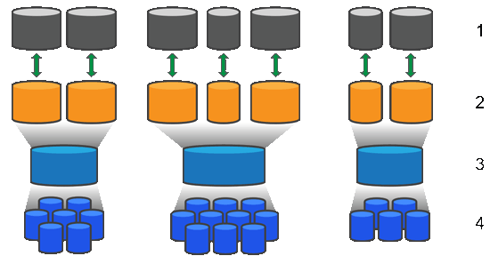

= How pools and volume groups work
:icons: font
:imagesdir: ../media/

[.lead]
To provision storage, you create either a pool or volume group that will contain the Hard Disk Drives (HDD) or Solid State Disk (SSD) drives that you want to use in your storage array.

Physical hardware is provisioned into logical components so that data can be organized and easily retrieved. There are two types of groupings supported:

* Pools
* RAID volume groups

The pools and volume groups are the top-level units of storage in a storage array: they divide the capacity of drives into manageable divisions. Within these logical divisions are the individual volumes or LUNs where data is stored. The following figure illustrates this concept.

^1^ Host LUNs;  ^2^ Volumes;  ^3^ Volume groups or pools;  ^4^ HDD or SSD drives

When a storage system is deployed, the first step is to present the available drive capacity to the various hosts by:

* Creating pools or volume groups with sufficient capacity
* Adding the number of drives required to meet performance requirements to the pool or volume group
* Selecting the desired level of RAID protection (if using volume groups) to meet specific business requirements

You can have pools or volume groups on the same storage system, but a drive cannot be part of more than one pool or volume group. Volumes that are presented to hosts for I/O are then created, using the space on the pool or volume group.

== Pools

Pools are designed to aggregate physical hard disk drives into a large storage space and to provide enhanced RAID protection for it. A pool creates many virtual RAID sets from the total number of drives assigned to the pool, and it spreads the data out evenly among all participating drives. If a drive is lost or added, System Manager dynamically re-balances the data across all the active drives.

Pools function as another RAID level, virtualizing the underlying RAID architecture to optimize performance and flexibility when performing tasks such as rebuilding, drive expansion, and handling drive loss. System Manager automatically sets the RAID level at 6 in an 8+2 configuration (eight data disks plus two parity disks).

=== Drive matching

You can choose from either HDD or SSDs for use in pools; however, as with volume groups, all drives in the pool must use the same technology. The controllers automatically select which drives to include, so you must make sure that you have a sufficient number of drives for the technology you choose.

=== Managing failed drives

Pools have a minimum capacity of 11 drives; however, one drive's worth of capacity is reserved for spare capacity in the event of a drive failure. This spare capacity is called "`preservation capacity.`"

When pools are created, a certain amount of capacity is preserved for emergency use. This capacity is expressed in terms of a number of drives in System Manager, but the actual implementation is spread across the entire pool of drives. The default amount of capacity that is preserved is based on the number of drives in the pool.

After the pool is created, you can change the preservation capacity value to more or less capacity, or even set it to no preservation capacity (0 drive's worth). The maximum amount of capacity that can be preserved (expressed as a number of drives) is 10, but the capacity that is available might be less, based on the total number of drives in the pool.

== Volume groups

Volume groups define how capacity is allotted in the storage system to volumes. Disk drives are organized into RAID groups and volumes reside across the drives in a RAID group. Therefore, volume group configuration settings identify which drives are part of the group and what RAID level is used.

When you create a volume group, controllers automatically select the drives to include in the group. You must manually choose the RAID level for the group. The capacity of the volume group is the total of the number of drives that you select, multiplied by their capacity.

=== Drive matching

You must match the drives in the volume group for size and performance. If there are smaller and larger drives in the volume group, all drives are recognized as the smallest capacity size. If there are slower and faster drives in the volume group, all drives are recognized at the slowest speed. These factors affect the performance and overall capacity of the storage system.

You cannot mix different drive technologies (HDD and SSD drives). RAID 3, 5, and 6 are limited to a maximum of 30 drives. RAID 1 and RAID 10 uses mirroring, so these volume groups must have an even number of disks.

=== Managing failed drives

Volume groups use hot spare drives as a standby in case a drive fails in RAID 1/10, RAID 3, RAID 5, or RAID 6 volumes contained in a volume group. A hot spare drive contains no data and adds another level of redundancy to your storage array.

If a drive fails in the storage array, the hot spare drive is automatically substituted for the failed drive without requiring a physical swap. If the hot spare drive is available when a drive fails, the controller uses redundancy data to reconstruct the data from the failed drive to the hot spare drive.
