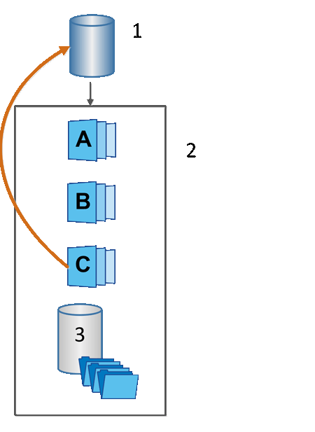

= Snapshot rollback
:icons: font
:imagesdir: ../media/

[.lead]
A rollback operation returns a base volume to a previous state, determined by the selected snapshot.

For the rollback, you can select a snapshot image from either of the following sources:

* *Snapshot image rollback*, for a full restore of a base volume.
* *Snapshot consistency group rollback*, which can be used to roll back one or more volumes.

During the rollback, the Snapshots feature preserves all snapshot images in the group. It also allows the host to access the base volume during this process, if needed for I/O operations.

When a rollback is launched, a background process sweeps through the logical block addresses (LBAs) for the base volume, and then finds copy-on-write data in the rollback snapshot image to be restored. Because the base volume is host-accessible for reads and writes, and all previously written data is available immediately, the reserved capacity volume must be large enough to contain all changes while the rollback is processing. The data transfer continues as a background operation until the rollback completes.

|===
a|
1   Base volume.
a|
2   Snapshot objects in a group.
a|
3   Snapshot group reserved capacity.
|===
