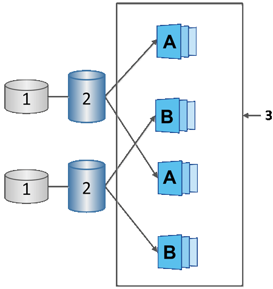

= Snapshot schedules and snapshot consistency groups
:icons: font
:imagesdir: ../media/

[.lead]
Use schedules for collection of snapshot images, and use snapshot consistency groups to manage multiple base volumes.

To easily manage snapshot operations for base volumes, you can use the following features:

* *Snapshot schedule* -- Automate snapshots for a single base volume.
* *Snapshot consistency group* -- Manage multiple base volumes as one entity.

== Snapshot schedule

If you want to automatically take snapshots for a base volume, you can create a schedule. For example, you can define a schedule that takes snapshot images every Saturday at midnight, on the first of every month, or on any dates and times you decide. After the maximum of 32 snapshots is reached for a single schedule, you can suspend scheduled snapshots, create more reserved capacity, or you can delete snapshots. Snapshots can be deleted manually or by automating the deletion process. After a snapshot image is deleted, additional reserved capacity is available for reuse.

== Snapshot consistency group

You create a snapshot consistency group when you want to make sure snapshot images are taken on multiple volumes at the same time. Snapshot image actions are performed on the snapshot consistency group as a whole. For example, you can schedule synchronized snapshots of all volumes with the same timestamp. Snapshot consistency groups are ideal for applications that span multiple volumes, such as database applications that store logs on one volume and the database files on another volume.

The volumes included in a snapshot consistency group are called member volumes. When you add a volume to a consistency group, System Manager automatically creates new reserved capacity that corresponds to that member volume. You can define a schedule to automatically create a snapshot image of each member volume.

|===
a|
1   Reserved capacity.
a|
2   Member volume.
a|
3   Consistency group snapshot images.
|===
