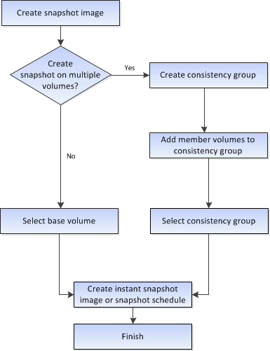
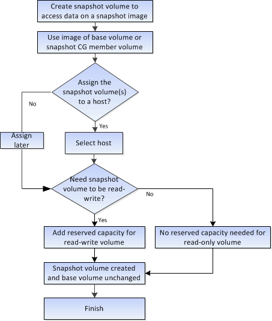

= Workflow for creating snapshot images and snapshot volumes
:icons: font
:imagesdir: ../media/

[.lead]
In System Manager, you can create snapshot images and snapshot volumes by following these steps.

== Workflow for creating snapshot images

== Workflow for creating snapshot volumes

