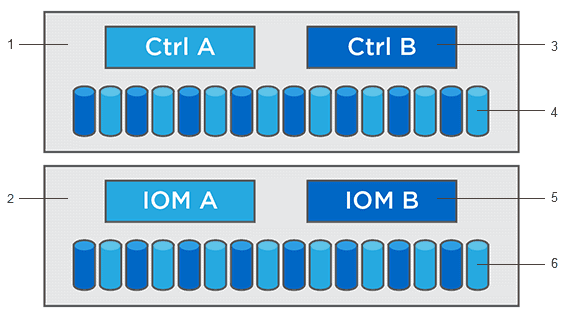

= Upgrade Center overview
:experimental:
:icons: font
:imagesdir: ../media/

[.lead]
Use the Upgrade Center to download the latest software and firmware and to upgrade your controllers and drives.

== Controller upgrade overview
You can upgrade your storage array's software and firmware for all the latest features and bug fixes.

=== Components included in the OS controller upgrade

Several storage array components contain software or hardware that you might want to upgrade occasionally.

* *Management software* -- System Manager is the software that manages the storage array.
* *Controller firmware* -- Controller firmware manages the I/O between hosts and volumes.
* *Controller NVSRAM* -- Controller NVSRAM is a controller file that specifies the default settings for the controllers.
* *IOM firmware* -- The I/O module (IOM) firmware manages the connection between a controller and a drive shelf. It also monitors the status of the components.
* *Supervisor software* -- Supervisor software is the virtual machine on a controller in which the software runs.

^1^ Controller shelf; ^2^ Drive shelf; ^3^ Software, controller firmware, controller NVSRAM, supervisor software; ^4^ Drive firmware; ^5^ IOM firmware; ^6^ Drive firmware

You can view your current software and firmware versions in the Software and Firmware Inventory dialog box. Go to menu:Support[Upgrade Center], and then click the link for *Software and Firmware Inventory*.

As part of the upgrade process, the host's multipath/failover driver and/or HBA driver might also need to be upgraded so the host can interact with the controllers correctly. To determine if this is the case, see the https://imt.netapp.com/matrix/#welcome[Netapp Interoperability Matrix Tool^].

=== When to stop I/O

If your storage array contains two controllers and you have a multipath driver installed, the storage array can continue processing I/O while the upgrade occurs. During the upgrade, controller A fails over all of its volumes to controller B, upgrades, takes back its volumes and all of controller B's volumes, and then upgrades controller B.

=== Pre-upgrade health check

A pre-upgrade health check runs as part of the upgrade process. The pre-upgrade health check assesses all storage array components to make sure the upgrade can proceed. The following conditions might prevent the upgrade:

* Failed assigned drives
* Hot spares in use
* Incomplete volume groups
* Exclusive operations running
* Missing volumes
* Controller in Non-optimal status
* Excess number of event log events
* Configuration database validation failure
* Drives with old versions of DACstore

You also can run the pre-upgrade health check separately without doing an upgrade.

== Drive upgrade overview
Drive firmware controls the low-level operating characteristics of a drive. Periodically, the drive manufacturers release updates to drive firmware to add new features, improve performance, and fix defects.

=== Online and offline drive firmware upgrades

There are two types of drive firmware upgrade methods: online and offline.

==== Online

During an online upgrade, drives are upgraded sequentially, one at a time. The storage array continues processing I/O while the upgrade occurs. You do not have to stop I/O. If a drive can do an online upgrade, the online method is used automatically.

Drives that can do an online upgrade include the following:

* Drives in an Optimal pool
* Drives in an Optimal redundant volume group (RAID 1, RAID 5, and RAID 6)
* Unassigned drives
* Standby hot spare drives

Doing an online drive firmware upgrade can take several hours exposing the storage array to potential volume failures. Volume failure could occur in these cases:

* In a RAID 1 or RAID 5 volume group, one drive fails while a different drive in the volume group is being upgraded.
* In a RAID 6 pool or volume group, two drives fail while a different drive in the pool or volume group is being upgraded.

==== Offline (parallel)

During an offline upgrade, all drives of the same drive type are upgraded at the same time. This method requires stopping I/O activity to the volumes associated with the selected drives. Because multiple drives can be upgraded concurrently (in parallel), the overall downtime is significantly reduced. If a drive can do only an offline upgrade, the offline method is used automatically.

The following drives MUST use the offline method:

* Drives in a non-redundant volume group (RAID 0)
* Drives in a non-optimal pool or volume group
* Drives in SSD cache

=== Compatibility

Each drive firmware file contains information about the drive type on which the firmware runs. You can download the specified firmware file only to a compatible drive. System Manager automatically checks compatibility during the upgrade process.
