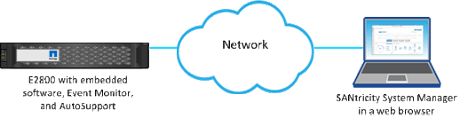

= Considerations for accessing System Manager
:icons: font
:imagesdir: ../media/

[.lead]
You select one or more storage arrays and use the Launch option to open System Manager when you want to configure and manage storage arrays.

System Manager is an embedded application on the controllers, which is connected to the network through an Ethernet management port. It includes all array-based functions.

To access System Manager, you must have:

* One of the array models listed here: link:https://docs.netapp.com/us-en/e-series/getting-started/learn-hardware-concept.html[E-Series hardware overview^]
* An out-of-band connection to a network management client with a web browser.

